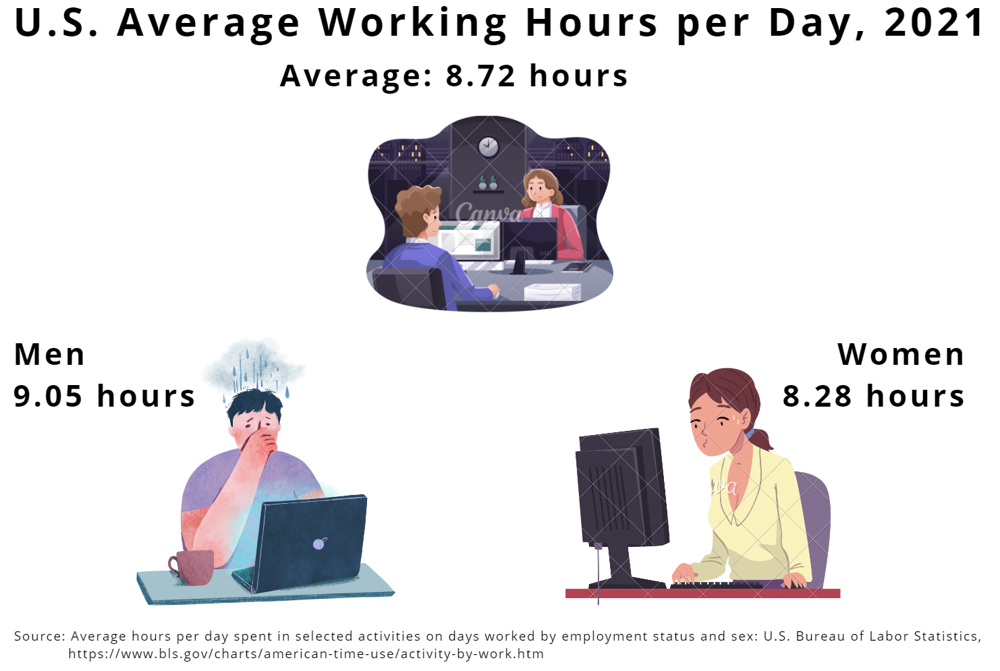
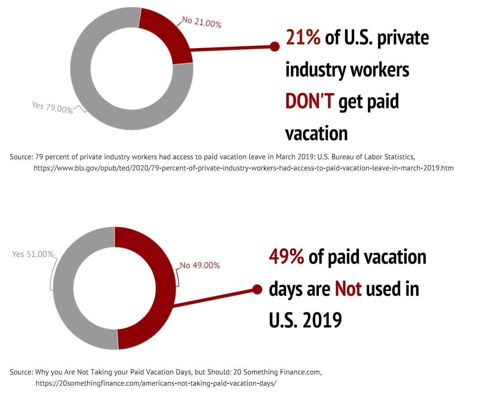

# Outline
## Project Summary 📖
This project looks at the working overtime situation in the U.S..
According to The ILO Department of Statistics, the average working hours in the United States are relatively short compared to countries like China and India. However, is it true that there is no overtime culture in the United States? Apparently, not so. Various social surveys and news reports show that employees in the U.S. suffer from significant overtime and are afraid to take vacations.
To change this dilemma, to find the root cause, and to help the CMU students who will soon graduate and enter the workforce learn to refuse to work overtime, we need each of us to concern and analyze working overtime.

## Topic 🎯
The working overtime situation in the U.S. and how to solve this dilemma.

## Reader Perspective 👨‍👨‍👧‍👦
As an employee or a prospective employee, I want to see the current overtime situation in the United States, the root causes of overtime and how to avoid it, so that I can try to avoid working overtime in the future to achieve work-life balance.

## Call To Action 💪
I can do this by refusing to work overtime meaningless because of anxiety, learning to balance life and work by keeping in mind the psychological and physical health hazards of overtime work. When overtime is so serious that it has infringed on my right, I will stand up to refuse and defend my right.

# Project Structure
The whole story is divided into **7 big scenarios** of smaller story points:   
**Scenario 1:** Introduce the working hours in the countries of the world and compare with each other.   
**Scenario 2:** Focus on the average working hours in the United States.   
**Scenario 3:** Pay attention to the US paid time off situation and holiday usage data.   
**Scenario 4:** Concern about the hazards of overtime work.   
**Scenario 5:** Explore why employees work overtime even though there are so many hazards.   
**Scenario 6:** Study what kind of people are more courageous to refuse to work overtime.   
**Scenario 7:** Call to reject meaningless working overtime.   

# Scenario 1️⃣

<noscript></noscript><object class='tableauViz'  style='display:none;'><param name='host_url' value='https%3A%2F%2Fpublic.tableau.com%2F' /> <param name='embed_code_version' value='3' /> <param name='site_root' value='' /><param name='name' value='Mapaverageworkhours&#47;Dashboard1' /><param name='tabs' value='no' /><param name='toolbar' value='yes' /><param name='static_image' value='https:&#47;&#47;public.tableau.com&#47;static&#47;images&#47;Ma&#47;Mapaverageworkhours&#47;Dashboard1&#47;1.png' /> <param name='animate_transition' value='yes' /><param name='display_static_image' value='yes' /><param name='display_spinner' value='yes' /><param name='display_overlay' value='yes' /><param name='display_count' value='yes' /><param name='language' value='zh-CN' /><param name='filter' value='publish=yes' /></object>

                

# Scenario 2️⃣
In this scenario, we will focus on the average working hours in the United States.   

# Scenario 3️⃣
In this scenario, we will pay attention to the US paid time off situation and holiday usage data.   

<noscript></noscript><object class='tableauViz'  style='display:none;'><param name='host_url' value='https%3A%2F%2Fpublic.tableau.com%2F' /> <param name='embed_code_version' value='3' /> <param name='site_root' value='' /><param name='name' value='PaidVacationandPaidHolidays&#47;Dashboard1' /><param name='tabs' value='no' /><param name='toolbar' value='yes' /><param name='static_image' value='https:&#47;&#47;public.tableau.com&#47;static&#47;images&#47;Pa&#47;PaidVacationandPaidHolidays&#47;Dashboard1&#47;1.png' /> <param name='animate_transition' value='yes' /><param name='display_static_image' value='yes' /><param name='display_spinner' value='yes' /><param name='display_overlay' value='yes' /><param name='display_count' value='yes' /><param name='language' value='zh-CN' /><param name='filter' value='publish=yes' /></object>

                

# Scenario 4️⃣
In this scenario, we will concern about the hazards of overtime work.   

<noscript></noscript><object class='tableauViz'  style='display:none;'><param name='host_url' value='https%3A%2F%2Fpublic.tableau.com%2F' /> <param name='embed_code_version' value='3' /> <param name='site_root' value='' /><param name='name' value='mentalhealth_16759654706020&#47;Dashboard1' /><param name='tabs' value='no' /><param name='toolbar' value='yes' /><param name='static_image' value='https:&#47;&#47;public.tableau.com&#47;static&#47;images&#47;me&#47;mentalhealth_16759654706020&#47;Dashboard1&#47;1.png' /> <param name='animate_transition' value='yes' /><param name='display_static_image' value='yes' /><param name='display_spinner' value='yes' /><param name='display_overlay' value='yes' /><param name='display_count' value='yes' /><param name='language' value='zh-CN' /><param name='filter' value='publish=yes' /></object>

                

# Scenario 5️⃣
In this scenario, we will explore why employees work overtime even though there are so many hazards.   

# Scenario 6️⃣
In this scenario, we will study what kind of people are more courageous to refuse to work overtime and take vacation.   

<noscript></noscript><object class='tableauViz'  style='display:none;'><param name='host_url' value='https%3A%2F%2Fpublic.tableau.com%2F' /> <param name='embed_code_version' value='3' /> <param name='site_root' value='' /><param name='name' value='Higherpaidworker&#47;Dashboard1' /><param name='tabs' value='no' /><param name='toolbar' value='yes' /><param name='static_image' value='https:&#47;&#47;public.tableau.com&#47;static&#47;images&#47;Hi&#47;Higherpaidworker&#47;Dashboard1&#47;1.png' /> <param name='animate_transition' value='yes' /><param name='display_static_image' value='yes' /><param name='display_spinner' value='yes' /><param name='display_overlay' value='yes' /><param name='display_count' value='yes' /><param name='language' value='zh-CN' /><param name='filter' value='publish=yes' /></object>

                

<noscript></noscript><object class='tableauViz'  style='display:none;'><param name='host_url' value='https%3A%2F%2Fpublic.tableau.com%2F' /> <param name='embed_code_version' value='3' /> <param name='site_root' value='' /><param name='name' value='PaidleaveAveragenumberofsickandvacationdaysbylengthofservicerequirement&#47;Dashboard1' /><param name='tabs' value='no' /><param name='toolbar' value='yes' /><param name='static_image' value='https:&#47;&#47;public.tableau.com&#47;static&#47;images&#47;Pa&#47;PaidleaveAveragenumberofsickandvacationdaysbylengthofservicerequirement&#47;Dashboard1&#47;1.png' /> <param name='animate_transition' value='yes' /><param name='display_static_image' value='yes' /><param name='display_spinner' value='yes' /><param name='display_overlay' value='yes' /><param name='display_count' value='yes' /><param name='language' value='zh-CN' /><param name='filter' value='publish=yes' /></object>

                

<noscript></noscript><object class='tableauViz'  style='display:none;'><param name='host_url' value='https%3A%2F%2Fpublic.tableau.com%2F' /> <param name='embed_code_version' value='3' /> <param name='site_root' value='' /><param name='name' value='Percentageofprivateindustryworkerswithaccesstopaidvacation&#47;Dashboard1' /><param name='tabs' value='no' /><param name='toolbar' value='yes' /><param name='static_image' value='https:&#47;&#47;public.tableau.com&#47;static&#47;images&#47;Pe&#47;Percentageofprivateindustryworkerswithaccesstopaidvacation&#47;Dashboard1&#47;1.png' /> <param name='animate_transition' value='yes' /><param name='display_static_image' value='yes' /><param name='display_spinner' value='yes' /><param name='display_overlay' value='yes' /><param name='display_count' value='yes' /><param name='language' value='zh-CN' /><param name='filter' value='publish=yes' /></object>

                

# Scenario 7️⃣
In this Scenario, we will call to reject meaningless working overtime.   

