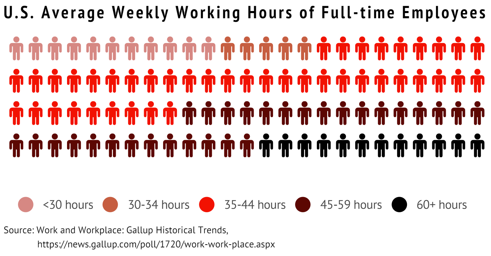
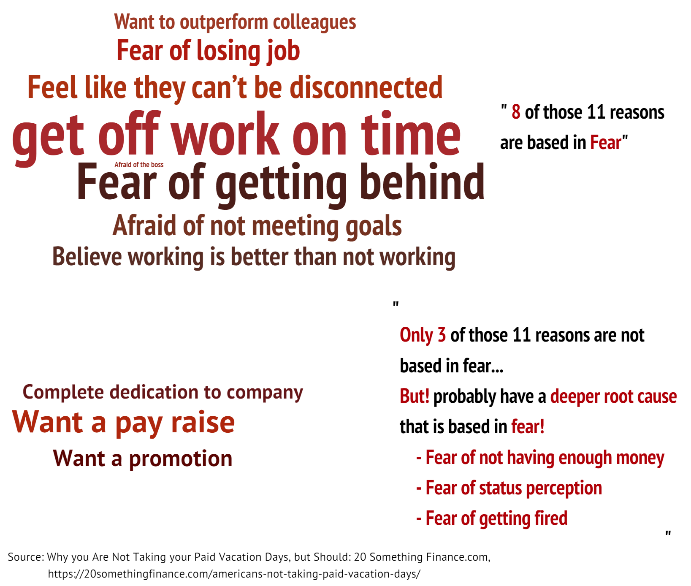

# Catalog of final project
**Part I:** [Brief Intro & Overview: Working Overtime in the U.S.](Final Project Part I.md)  
**Part II:**  
**Part III:**  
**Final website:**  

# Outline
## Project Summary 📖
This project looks at the working overtime situation in the U.S..
According to The ILO Department of Statistics, the average working hours in the United States are relatively short compared to countries like China and India. However, is it true that there is no overtime culture in the United States? Apparently, not so. Various social surveys and news reports show that employees in the U.S. suffer from significant overtime and are afraid to take vacations.
To change this dilemma, to find the root cause, and to help the CMU students who will soon graduate and enter the workforce learn to refuse to work overtime, we need each of us to concern and analyze working overtime.   

## Topic 🎯
The working overtime situation in the U.S. and how to solve this dilemma.   

## Reader Perspective 👨‍👨‍👧‍👦
As an employee or a prospective employee, I want to see the current overtime situation in the United States, the root causes of overtime and how to avoid it, so that I can try to avoid working overtime in the future to achieve work-life balance.   

## Call To Action 💪
I can do this by refusing to work overtime meaningless because of anxiety, learning to balance life and work by keeping in mind the psychological and physical health hazards of overtime work. When overtime is so serious that it has infringed on my right, I will stand up to refuse and defend my right.   

# Project Structure
The whole story is divided into **7 big scenarios** of smaller story points:   
**Scenario 1:** Introduce the working hours in the countries of the world and compare with each other.   
**Scenario 2:** Focus on the average working hours in the United States.   
**Scenario 3:** Pay attention to the US paid time off situation and holiday usage data.   
**Scenario 4:** Concern about the hazards of overtime work.   
**Scenario 5:** Explore why employees work overtime even though there are so many hazards.   
**Scenario 6:** Study what kind of people are more courageous to refuse to work overtime.   
**Scenario 7:** Call to reject meaningless working overtime.   

# Scenario 1️⃣
Introduce the working hours in the countries of the world and compare with each other.    
The [data](https://ilostat.ilo.org/topics/working-time/) of average hours per week per employed person is useful to the level of working overtime in the countries of the world[^1].    

<noscript></noscript><object class='tableauViz'  style='display:none;'><param name='host_url' value='https%3A%2F%2Fpublic.tableau.com%2F' /> <param name='embed_code_version' value='3' /> <param name='site_root' value='' /><param name='name' value='Mapaverageworkhours&#47;Dashboard1' /><param name='tabs' value='no' /><param name='toolbar' value='yes' /><param name='static_image' value='https:&#47;&#47;public.tableau.com&#47;static&#47;images&#47;Ma&#47;Mapaverageworkhours&#47;Dashboard1&#47;1.png' /> <param name='animate_transition' value='yes' /><param name='display_static_image' value='yes' /><param name='display_spinner' value='yes' /><param name='display_overlay' value='yes' /><param name='display_count' value='yes' /><param name='language' value='zh-CN' /><param name='filter' value='publish=yes' /></object>

                

   
 
# Scenario 2️⃣
In this scenario, we will focus on the average working hours in the United States.   
The [survey](https://news.gallup.com/poll/1720/work-work-place.aspx)[^2] from Gallup Company and [report from U.S. Bureau of Labor Statistics](https://www.bls.gov/charts/american-time-use/activity-by-work.htm)[^3] will give us more inspiration.   

   
 
# Scenario 3️⃣
In this scenario, we will pay attention to the US paid time off situation and holiday usage data.   
If we compare the [paid Vacation and paid Holidays of each OECD nations](https://cepr.net/images/stories/reports/no-vacation-nation-2019-05.pdf)[^4], we would find the zero day in the U.S.   

<noscript></noscript><object class='tableauViz'  style='display:none;'><param name='host_url' value='https%3A%2F%2Fpublic.tableau.com%2F' /> <param name='embed_code_version' value='3' /> <param name='site_root' value='' /><param name='name' value='PaidVacationandPaidHolidays&#47;Dashboard1' /><param name='tabs' value='no' /><param name='toolbar' value='yes' /><param name='static_image' value='https:&#47;&#47;public.tableau.com&#47;static&#47;images&#47;Pa&#47;PaidVacationandPaidHolidays&#47;Dashboard1&#47;1.png' /> <param name='animate_transition' value='yes' /><param name='display_static_image' value='yes' /><param name='display_spinner' value='yes' /><param name='display_overlay' value='yes' /><param name='display_count' value='yes' /><param name='language' value='zh-CN' /><param name='filter' value='publish=yes' /></object>

                

From the [data from U.S. Bureau of Labor Statistics](https://www.bls.gov/opub/ted/2020/79-percent-of-private-industry-workers-had-access-to-paid-vacation-leave-in-march-2019.htm)[^5] and the [news from 20 Something Finance](https://20somethingfinance.com/americans-not-taking-paid-vacation-days/)[^6], we would find still some workers cannot have access to paid vacation or don't use it.   

   
 
# Scenario 4️⃣
In this scenario, we will concern about the hazards of overtime work.   

[Prevalence of depression, anxiety, PTSD, and suicidal ideation](https://www.statista.com/statistics/1255169/mental-health-conditions-among-health-workers-by-hours-worked-per-week-us/) among public health workers in the United States as of April 2021, by hours worked per week will give us more idea[^7].   

<noscript></noscript><object class='tableauViz'  style='display:none;'><param name='host_url' value='https%3A%2F%2Fpublic.tableau.com%2F' /> <param name='embed_code_version' value='3' /> <param name='site_root' value='' /><param name='name' value='mentalhealth_16759654706020&#47;Dashboard1' /><param name='tabs' value='no' /><param name='toolbar' value='yes' /><param name='static_image' value='https:&#47;&#47;public.tableau.com&#47;static&#47;images&#47;me&#47;mentalhealth_16759654706020&#47;Dashboard1&#47;1.png' /> <param name='animate_transition' value='yes' /><param name='display_static_image' value='yes' /><param name='display_spinner' value='yes' /><param name='display_overlay' value='yes' /><param name='display_count' value='yes' /><param name='language' value='zh-CN' /><param name='filter' value='publish=yes' /></object>

                

   
 
# Scenario 5️⃣
In this scenario, we will explore why employees work overtime even though there are so many hazards.   
the survey from the [news of 20 Something Finance](https://20somethingfinance.com/americans-not-taking-paid-vacation-days/) will give us the answer. 8 of those 11 reasons are based in fear. And only 3 of those 11 reasons are not based in fear. But, they probably have a deeper root cause that is based in fear![^8]    

   

# Scenario 6️⃣
In this scenario, we will study what kind of people are more courageous to refuse to work overtime and have paid vacation.   
From the data of U.S. Bureau of Labor Statistics, we could find that [higher paid](https://www.bls.gov/opub/ted/2021/higher-paid-workers-more-likely-than-lower-paid-workers-to-have-paid-leave-benefits-in-2020.htm) workers are more likely than lower paid workers to have paid leave benefits[^9]. And [longer service requirement](https://www.bls.gov/charts/employee-benefits/paid-leave-sick-vacation-days-by-service-requirement.htm) more likely to have longer vacation[^10]. As for [industry](https://www.bls.gov/ebs/factsheets/paid-vacations.htm), manufacturing, finance and information industries are more likely to have paid leave benefits[^11].

<noscript></noscript><object class='tableauViz'  style='display:none;'><param name='host_url' value='https%3A%2F%2Fpublic.tableau.com%2F' /> <param name='embed_code_version' value='3' /> <param name='site_root' value='' /><param name='name' value='Higherpaidworker&#47;Dashboard1' /><param name='tabs' value='no' /><param name='toolbar' value='yes' /><param name='static_image' value='https:&#47;&#47;public.tableau.com&#47;static&#47;images&#47;Hi&#47;Higherpaidworker&#47;Dashboard1&#47;1.png' /> <param name='animate_transition' value='yes' /><param name='display_static_image' value='yes' /><param name='display_spinner' value='yes' /><param name='display_overlay' value='yes' /><param name='display_count' value='yes' /><param name='language' value='zh-CN' /><param name='filter' value='publish=yes' /></object>

                

<noscript></noscript><object class='tableauViz'  style='display:none;'><param name='host_url' value='https%3A%2F%2Fpublic.tableau.com%2F' /> <param name='embed_code_version' value='3' /> <param name='site_root' value='' /><param name='name' value='PaidleaveAveragenumberofsickandvacationdaysbylengthofservicerequirement&#47;Dashboard1' /><param name='tabs' value='no' /><param name='toolbar' value='yes' /><param name='static_image' value='https:&#47;&#47;public.tableau.com&#47;static&#47;images&#47;Pa&#47;PaidleaveAveragenumberofsickandvacationdaysbylengthofservicerequirement&#47;Dashboard1&#47;1.png' /> <param name='animate_transition' value='yes' /><param name='display_static_image' value='yes' /><param name='display_spinner' value='yes' /><param name='display_overlay' value='yes' /><param name='display_count' value='yes' /><param name='language' value='zh-CN' /><param name='filter' value='publish=yes' /></object>

                

<noscript></noscript><object class='tableauViz'  style='display:none;'><param name='host_url' value='https%3A%2F%2Fpublic.tableau.com%2F' /> <param name='embed_code_version' value='3' /> <param name='site_root' value='' /><param name='name' value='Percentageofprivateindustryworkerswithaccesstopaidvacation&#47;Dashboard1' /><param name='tabs' value='no' /><param name='toolbar' value='yes' /><param name='static_image' value='https:&#47;&#47;public.tableau.com&#47;static&#47;images&#47;Pe&#47;Percentageofprivateindustryworkerswithaccesstopaidvacation&#47;Dashboard1&#47;1.png' /> <param name='animate_transition' value='yes' /><param name='display_static_image' value='yes' /><param name='display_spinner' value='yes' /><param name='display_overlay' value='yes' /><param name='display_count' value='yes' /><param name='language' value='zh-CN' /><param name='filter' value='publish=yes' /></object>

                

   
 
# Scenario 7️⃣
In this Scenario, we will call to reject meaningless working overtime.   

   
 
# Data Source 📊
The sources of the data have been labeled below the individual sketches. Here again, the data sources are summarized.  
[1]: [Statistics on working time: The ILO Department of Statistics](https://ilostat.ilo.org/topics/working-time/)  
[2]: [Work and Workplace: Gallup Historical Trends](https://news.gallup.com/poll/1720/work-work-place.aspx)  
[3]: [Average hours per day spent in selected activities on days worked by employment status and sex: U.S. Bureau of Labor Statistics](https://www.bls.gov/charts/american-time-use/activity-by-work.htm)  
[4]: [No-Vacation Nation, Revised: CENTER FOR ECONOMIC AND POLICY RESEARCH](https://cepr.net/images/stories/reports/no-vacation-nation-2019-05.pdf)  
[5]: [79 percent of private industry workers had access to paid vacation leave in March 2019: U.S. Bureau of Labor Statistics](https://www.bls.gov/opub/ted/2020/79-percent-of-private-industry-workers-had-access-to-paid-vacation-leave-in-march-2019.htm)  
[6]: [Why you Are Not Taking your Paid Vacation Days, but Should: 20 Something Finance.com](https://20somethingfinance.com/americans-not-taking-paid-vacation-days/)  
[7]: [Prevalence of depression, anxiety, PTSD, and suicidal ideation in the past 2 weeks among public health workers in the United States as of April 2021, by hours worked per week: Statistics](https://www.statista.com/statistics/1255169/mental-health-conditions-among-health-workers-by-hours-worked-per-week-us/)  
[8]: [Why you Are Not Taking your Paid Vacation Days, but Should: 20 Something Finance.com](https://20somethingfinance.com/americans-not-taking-paid-vacation-days/)  
[9]: [Higher paid workers more likely than lower paid workers to have paid leave benefits in 2020: The Economics Daily: U.S. Bureau of Labor Statistics](https://www.bls.gov/opub/ted/2021/higher-paid-workers-more-likely-than-lower-paid-workers-to-have-paid-leave-benefits-in-2020.htm)  
[10]: [Paid leave benefits: Average number of sick and vacation days by length of service requirement: U.S. Bureau of Labor Statistics](https://www.bls.gov/charts/employee-benefits/paid-leave-sick-vacation-days-by-service-requirement.htm)  
[11]: [Who receives paid vacations? : U.s. Bureau of Labor Statistics](https://www.bls.gov/ebs/factsheets/paid-vacations.htm)  

# Method and Medium
The chart of final project will be designed and created with Tebleau, Inforgram, Flourish and Canva.  
The final deliverables will be an interactive stand-alone project created with Shorthand. Each of the scenarios depicted above will have one or two pages on the final Shorthand website. Interaction and movement between pages will be used to promote interactivity and engagement with potential audiences. Moreover, key information will be highlighted through the use of color.
  
  
  
🥰Thanks for your reading. If you are interested in other works from my course portfolio of [Telling Stories with Data](https://api.heinz.cmu.edu/courses_api/course_detail/94-870/) at CMU, please feel free to visit my [Home Page](https://ivyliyuxuan.github.io/LI-YUXUAN-TSWD-Portfolio/). 
  
  
  
 
[^1]: Statistics on working time: The ILO Department of Statistics, https://ilostat.ilo.org/topics/working-time/
[^2]: Work and Workplace: Gallup Historical Trends, https://news.gallup.com/poll/1720/work-work-place.aspx
[^3]: Average hours per day spent in selected activities on days worked by employment status and sex: U.S. Bureau of Labor Statistics, https://www.bls.gov/charts/american-time-use/activity-by-work.htm
[^4]: No-Vacation Nation, Revised: CENTER FOR ECONOMIC AND POLICY RESEARCH, https://cepr.net/images/stories/reports/no-vacation-nation-2019-05.pdf
[^5]: 79 percent of private industry workers had access to paid vacation leave in March 2019: U.S. Bureau of Labor Statistics, https://www.bls.gov/opub/ted/2020/79-percent-of-private-industry-workers-had-access-to-paid-vacation-leave-in-march-2019.htm
[^6]: Why you Are Not Taking your Paid Vacation Days, but Should: 20 Something Finance.com, https://20somethingfinance.com/americans-not-taking-paid-vacation-days/
[^7]: Prevalence of depression, anxiety, PTSD, and suicidal ideation in the past 2 weeks among public health workers in the United States as of April 2021, by hours worked per week: Statistics, https://www.statista.com/statistics/1255169/mental-health-conditions-among-health-workers-by-hours-worked-per-week-us/
[^8]: Why you Are Not Taking your Paid Vacation Days, but Should: 20 Something Finance.com, https://20somethingfinance.com/americans-not-taking-paid-vacation-days/
[^9]: Higher paid workers more likely than lower paid workers to have paid leave benefits in 2020: The Economics Daily: U.S. Bureau of Labor Statistics, https://www.bls.gov/opub/ted/2021/higher-paid-workers-more-likely-than-lower-paid-workers-to-have-paid-leave-benefits-in-2020.htm
[^10]: Paid leave benefits: Average number of sick and vacation days by length of service requirement: U.S. Bureau of Labor Statistics, https://www.bls.gov/charts/employee-benefits/paid-leave-sick-vacation-days-by-service-requirement.htm
[^11]: Who receives paid vacations? : U.s. Bureau of Labor Statistics, https://www.bls.gov/ebs/factsheets/paid-vacations.htm
