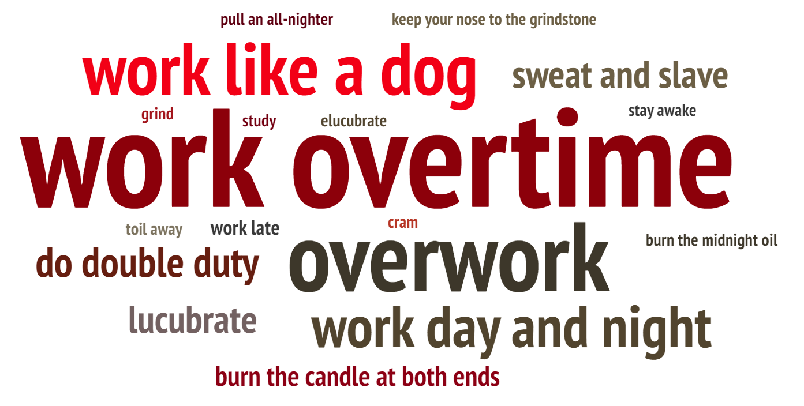
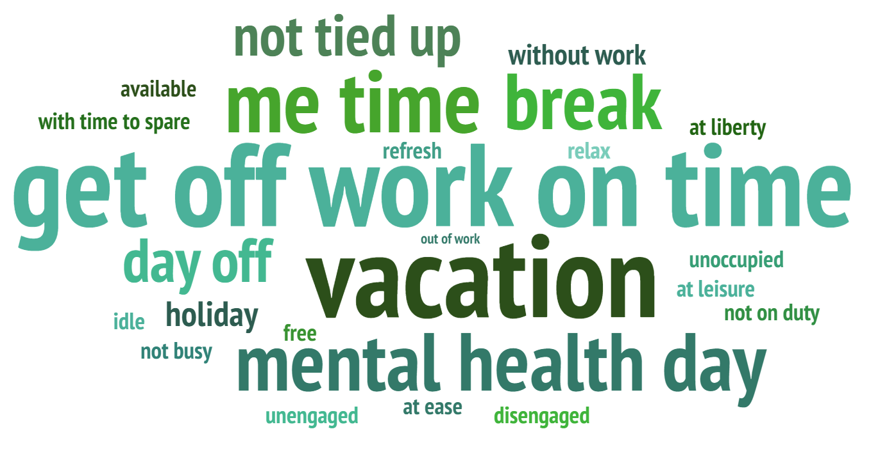

# Catalog of Final Project
**Part I:** [Brief Intro & Overview: Working Overtime in the U.S.](Final Project Part I.md)  
**Part II:** [storyboards and user research](Final Project Part II.md) 
**Part III:**  
**Final website:**  

# Outline
## Project Summary 📖
This project looks at the working overtime situation in the U.S..
According to The ILO Department of Statistics, the average working hours in the United States are relatively short compared to countries like China and India. However, is it true that there is no overtime culture in the United States? Apparently, not so. Various social surveys and news reports show that employees in the U.S. suffer from significant overtime and are afraid to take vacations.
To change this dilemma, to find the root cause, and to help the CMU students who will soon graduate and enter the workforce learn to refuse to work overtime, we need each of us to concern and analyze working overtime.   

## Topic 🎯
How to solve the dilemma of working overtime in the U.S.    
 
## Project Structure
The whole story is divided into **5 big scenarios** with some small stories:   
**Scenario 1:** Setup - Look into the status of overtime in the United States
&emsp **Story 1.1:** Introduce the working hours in the countries of the world and compare with each other.   
&emsp **Story 1.2:** (small conflict) Focus on the average working hours in the United States.   
&emsp **Story 1.3:** Pay attention to the US paid time off situation and holiday usage data.   
**Scenario 2:** Conflict- Concern about the hazards of overtime work.   
**Scenario 3:** In-depth exploration - Explore why employees work overtime even though there are so many hazards.   
**Scenario 4:** Resolution - How to refuse to work overtime
&emsp **Story 4.1:** Study what kind of people are more courageous to refuse to work overtime.  
&emsp **Story 4.2:** How to become a person who can refuse to work overtime
**Scenario 5:** Call on - Call to reject meaningless working overtime.   
  
  
  
# Wireframes and storyboards
## Scenario 1️⃣: Setup - Look into the status of overtime in the United States
### Story 1.1: Introduce the working hours in the countries of the world and compare with each other.
**“From the graph we can find that China and India are the ones with the highest working hours, and the situation in the US does not seem to be as bad.”**
  
  
At the beginning of the story, we will introduce the working hours in the countries of the world and compare with each other.    
At this point, viewers may be satisfied with the overtime situation in the United States. WoW! It seems that in the U.S. overtime is not serious Introduce the working hours in the countries of the world and compare with each other. 
The [data](https://ilostat.ilo.org/topics/working-time/) of average hours per week per employed person is useful to the level of working overtime in the countries of the world[^1].    

<noscript></noscript><object class='tableauViz'  style='display:none;'><param name='host_url' value='https%3A%2F%2Fpublic.tableau.com%2F' /> <param name='embed_code_version' value='3' /> <param name='site_root' value='' /><param name='name' value='Mapaverageworkhours&#47;Dashboard1' /><param name='tabs' value='no' /><param name='toolbar' value='yes' /><param name='static_image' value='https:&#47;&#47;public.tableau.com&#47;static&#47;images&#47;Ma&#47;Mapaverageworkhours&#47;Dashboard1&#47;1.png' /> <param name='animate_transition' value='yes' /><param name='display_static_image' value='yes' /><param name='display_spinner' value='yes' /><param name='display_overlay' value='yes' /><param name='display_count' value='yes' /><param name='language' value='zh-CN' /><param name='filter' value='publish=yes' /></object>

                

   
### Story 1.2: (small conflict) Focus on the average working hours in the United States.
**“But the U.S. employees are also working overtime..."**  
  
After the audience is satisfied with the current state of overtime in America, I want to set up a small conflict here to grab the audience's attention. Here, I will focus on the average working hours in the United States.   
  
The [survey](https://news.gallup.com/poll/1720/work-work-place.aspx)[^2] from Gallup Company and [report from U.S. Bureau of Labor Statistics](https://www.bls.gov/charts/american-time-use/activity-by-work.htm)[^3] will give us more inspiration.   
  

  

<a href="https://infogram.com/b3296a7f-0b07-43f6-9f21-cb12ecc4f358" style="color:#989898!important;text-decoration:none!important;" target="_blank">U.S. Average Weekly Working Hours</a> <a href="https://infogram.com" style="color:#989898!important;text-decoration:none!important;" target="_blank" rel="nofollow">Infogram</a>

  
  

   
 
### Story 1.3: Pay attention to the US paid time off situation and holiday usage data.
In this scenario, we will pay attention to the US paid time off situation and holiday usage data.   
  
**“The U.S. remains the only advanced economy in the world that does not guarantee its workers paid vacation and holidays."**
  
  
If we compare the [paid Vacation and paid Holidays of each OECD nations](https://cepr.net/images/stories/reports/no-vacation-nation-2019-05.pdf)[^4], we would find the zero day in the U.S.   
  

<iframe src='https://flo.uri.sh/visualisation/12806064/embed' title='Interactive or visual content' class='flourish-embed-iframe' frameborder='0' scrolling='no' style='width:1100px;height:700px;' sandbox='allow-same-origin allow-forms allow-scripts allow-downloads allow-popups allow-popups-to-escape-sandbox allow-top-navigation-by-user-activation'></iframe>

  

From the [data from U.S. Bureau of Labor Statistics](https://www.bls.gov/opub/ted/2020/79-percent-of-private-industry-workers-had-access-to-paid-vacation-leave-in-march-2019.htm)[^5] and the [news from 20 Something Finance](https://20somethingfinance.com/americans-not-taking-paid-vacation-days/)[^6], we would find still some workers cannot have access to paid vacation or don't use it.   
  
**"21% of U.S. private industry workers would tell you that they don't have access to paid holidays. Crazy, right?"**  
  
**“What's more unfortunate is that even for those employees who can have vacation time, they are afraid to use it up.”**  
  

  
 
## Scenario 2️⃣: Conflict - Concern about the hazards of overtime work.
**“On CMU's campus, there are always people who chant "My heart is in the work". But working long hours can bring you a great deal of danger.”**
  
  
In this scenario, we will concern about the hazards of overtime work.   

[Prevalence of depression, anxiety, PTSD, and suicidal ideation](https://www.statista.com/statistics/1255169/mental-health-conditions-among-health-workers-by-hours-worked-per-week-us/) among public health workers in the United States as of April 2021, by hours worked per week will give us more idea[^7].   

  
   
 
## Scenario 3️⃣: In-depth exploration - Explore why employees work overtime even though there are so many hazards.
**"With so many hazards, why do we still work overtime? Fear is the root root cause"**  
  
In this scenario, we will explore why employees work overtime even though there are so many hazards.   
the survey from the [news of 20 Something Finance](https://20somethingfinance.com/americans-not-taking-paid-vacation-days/) will give us the answer. 8 of those 11 reasons are based in fear. And only 3 of those 11 reasons are not based in fear. But, they probably have a deeper root cause that is based in fear![^8]    

<a href="https://infogram.com/a70b09c1-f5f1-4c4c-b550-b97cb2ae4cff" style="color:#989898!important;text-decoration:none!important;" target="_blank">Why Do We Work Overtime?</a> <a href="https://infogram.com" style="color:#989898!important;text-decoration:none!important;" target="_blank" rel="nofollow">Infogram</a>

<a href="https://infogram.com/4d16b38b-ab88-4019-9068-e1d913319de4" style="color:#989898!important;text-decoration:none!important;" target="_blank">don't use vacation</a> <a href="https://infogram.com" style="color:#989898!important;text-decoration:none!important;" target="_blank" rel="nofollow">Infogram</a>

   

## Scenario 4️⃣: Resolution - How to refuse to work overtime
### Story 4.1: Study what kind of people are more courageous to refuse to work overtime.
In this scenario, we will study what kind of people are more courageous to refuse to work overtime and have paid vacation.   
   
**"Higher paid workers more likely to have paid leave benefits, for both paid vacation and paid holidays"**  
  
**"Longer service requirement brings longer vacation in 2020"**  
  
**"If you work in the manufacturing, finance or information industries, then you're in luck."**  
  
From the data of U.S. Bureau of Labor Statistics, we could find that [higher paid](https://www.bls.gov/opub/ted/2021/higher-paid-workers-more-likely-than-lower-paid-workers-to-have-paid-leave-benefits-in-2020.htm) workers are more likely than lower paid workers to have paid leave benefits[^9]. And [longer service requirement](https://www.bls.gov/charts/employee-benefits/paid-leave-sick-vacation-days-by-service-requirement.htm) more likely to have longer vacation[^10]. As for [industry](https://www.bls.gov/ebs/factsheets/paid-vacations.htm), manufacturing, finance and information industries are more likely to have paid leave benefits[^11].

  
  
  

<noscript></noscript><object class='tableauViz'  style='display:none;'><param name='host_url' value='https%3A%2F%2Fpublic.tableau.com%2F' /> <param name='embed_code_version' value='3' /> <param name='site_root' value='' /><param name='name' value='PaidleaveAveragenumberofsickandvacationdaysbylengthofservicerequirement&#47;Dashboard1' /><param name='tabs' value='no' /><param name='toolbar' value='yes' /><param name='static_image' value='https:&#47;&#47;public.tableau.com&#47;static&#47;images&#47;Pa&#47;PaidleaveAveragenumberofsickandvacationdaysbylengthofservicerequirement&#47;Dashboard1&#47;1.png' /> <param name='animate_transition' value='yes' /><param name='display_static_image' value='yes' /><param name='display_spinner' value='yes' /><param name='display_overlay' value='yes' /><param name='display_count' value='yes' /><param name='language' value='zh-CN' /><param name='filter' value='publish=yes' /></object>

                

  

  
  

<noscript></noscript><object class='tableauViz'  style='display:none;'><param name='host_url' value='https%3A%2F%2Fpublic.tableau.com%2F' /> <param name='embed_code_version' value='3' /> <param name='site_root' value='' /><param name='name' value='Percentageofprivateindustryworkerswithaccesstopaidvacation&#47;Dashboard1' /><param name='tabs' value='no' /><param name='toolbar' value='yes' /><param name='static_image' value='https:&#47;&#47;public.tableau.com&#47;static&#47;images&#47;Pe&#47;Percentageofprivateindustryworkerswithaccesstopaidvacation&#47;Dashboard1&#47;1.png' /> <param name='animate_transition' value='yes' /><param name='display_static_image' value='yes' /><param name='display_spinner' value='yes' /><param name='display_overlay' value='yes' /><param name='display_count' value='yes' /><param name='language' value='zh-CN' /><param name='filter' value='publish=yes' /></object>

                

  
### Story 4.2: How to become a person who can refuse to work overtime

   
  
 
## Scenario 5️⃣: Call on - Call to reject meaningless working overtime.
**"Please stand up to refuse overtime work"**
In this Scenario, we will call to reject meaningless working overtime.   

  

   
 
# User Research and interviews 👂
## Target audience
The main target audience are employees or prospective employees who are suffering or at risk of suffering from overtime.
Because the call to action of this whole project is to ask for workers to stand up to refuse and defend their right when overtime is so serious that it has infringed on their right, employees or prospective employees who are suffering or at risk of suffering from overtime will be more likely to relate to the content.

## Approach to identifying representative individuals to interview
I will be graduating from Carnegie Mellon this May and will start working after that. My classmates are the same. So all of my classmates are potential employees. Meanwhile, my seniors, they have started working for about 6 years, so they are most likely the employees who are suffering from overtime. 
To diversify the interviewees, the individuals chosen have different working experience and education experience. Some haven't started working yet, but some have been working for 5 years. Some are working in the financial industry, but some are working in the technology industry. 

## Interview record
I have shared the wireframes with three other people and collected feedback. The following are the relevant records: 
👧 **The first interviewee: new graduate student, female, 23 years old**  

| Questions | Answer from the first interviewee |
| --------------------- | ---------------------  |
| Are all the storyboards clear and closely related to the main topic ? | It's clear and closely related to the main topic, but the style in which the interface is scrolled breaks the link between parts. So hopefully a tab directory or other cue can be added to give the audience a clearer idea of the structure. |
| Is there anything you find surprising? What works well in charts? | I really like the chart to compare the paid Vacation and paid Holidays of each OECD nations, because the idea of adding the flag of the corresponding country to each bar is very interesting. And that chart uses a lot of gray for minor information, while the author uses a red alert for the US, which has only 0 legal paid holidays, allowing me to catch the important information at first glance. I was very shocked at what the chart conveyed. The U.S. remains the only advanced economy in the world that does not guarantee its workers paid vacation and holidays! |
| Is there anything you find confusing? What doesn’t work well in charts? | xxxxx  |
| Do you think the color parttern design suit the topic well? | The color scheme is quite simple to understand. Usually, I see red and think it represents a bad message and is important. And judging from the title and the rest of the description, I know that the author does use red to indicate a warning message, which confirms my suspicions. But whether there is good color matching between the different Scenarios is something the authors need to pay further attention to. After all, the page is a collation and the viewer will have a very intuitive overall feeling. |
| How engaged do you feel about the whole story? Will you respond to the call to action? | This content is of great interest to me because I am about to enter the workplace. I've heard a lot of stories about overtime, and it scares me a lot. I am desperate for the overtime culture to change. So I'm so engaged about the whole story. I have become clearly aware of the dangers of working overtime. If I also encounter unreasonable overtime arrangements in the future, I hope I can bravely refuse them instead of suffering them in silence.  |

  
  
👨‍🦲 **The second interviewee: adult with 6 years of experience in financial services, investor, male, 30 years old**  

| Questions | Answer from the first interviewee |
| --------------------- | ---------------------  |
| Are all the storyboards clear and closely related to the main topic ? | I think it's clear and closely related to the main topic, but I would like to see the cover and the small cover of each Scenario. Now I can only see how the short stories in each chapter will be presented, but not the cover and other designs in the pages. |
| Is there anything you find surprising? What works well in charts? | I really like the conflict brought by the first chart and the second chart. The author uses the first chart to tell us that China and India are the ones with the highest working hours, and the situation in the US does not seem to be as bad. However, in the second chart, we can find that the U.S. employees are also working overtime. This conflict in these two charts really interested and surprised me. |
| Is there anything you find confusing? What doesn’t work well in charts? | xxxxx  |
| Do you think the color parttern design suit the topic well? | The color palette is very simple to follow. Because overtime is such a depressing topic, it's fitting that the author used a dark background in some of the charts. Also, I really like the author's use of red and gray together. In this case, the red represents important information with a warning message, while the gray is a secondary message. This allows the viewer to notice the important information at first glance. Also, I noticed that the author used the warm sun as a background in the section about vacations, which is very appropriate. Also, the positive information about the vacation, etc. is in green, which makes it easy for the viewer to pick up on it. |
| How engaged do you feel about the whole story? Will you respond to the call to action? | I'm so engaged about the whole story. Nowadays, overtime in the financial industry is very serious, and I often have to work late. In the past 6 years, I often neglected my family or friends because of overtime, which made me sad. But because of the serious overtime culture in the company, I often dare not refuse to work overtime. However, after seeing that so many other countries have legal paid leave and there are still many ways to avoid overtime, I think I will try my best to avoid overtime in my future work.  |

  
  

🧑 **The third interviewee: adult with 2 years of experience in technology companies, Algorithm Engineer, male, 25 years old**  

| Questions | Answer from the first interviewee |
| --------------------- | ---------------------  |
| Are all the storyboards clear and closely related to the main topic ? | It's clear and closely related to the main topic, but because there is so much of content, I would like to give a side note, especially on how to solve the overtime problem. I'm going through overtime right now, so I'm very eager to know how to fix it. |
| Is there anything you find surprising? What works well in charts? | I really like the chart about the longer you work, the more likely you are to suffer from mental illness. The design of this chart is very good! It's a interactive gauge visualizations. The control button in the chart can let us to choose the kind of mental illness to learn. The gauge charts are divided into three part, lower risk, likely, very likely. This can well present that the longer you work, the more likely you are to suffer from mental illness. I'm really really enjoy this chart. It surprised me! |
| Is there anything you find confusing? What doesn’t work well in charts? | xxxxx  |
| Do you think the color parttern design suit the topic well? | The use of color is very appropriate and allows me to notice key elements at once. For example, when I see red, I know it is important information with a warning meaning, while green is representing a relatively good situation. However, since I haven't seen the complete finished webpage, I can't yet judge whether the color scheme of the whole webpage is harmonious, which involves the author's aesthetic and design ability.  |
| How engaged do you feel about the whole story? Will you respond to the call to action? | I'm completely engaged in the entire story. My boss always gives me a lot of whimsical demands. And I was afraid of being fired because I was an employee who had just joined the company for two years, so I was always afraid to refuse overtime work. Through this story, I found that many people, like me, are afraid to refuse to work overtime because of the fundamental reason. This made me start to reflect on it. At the same time, seeing that overtime has so many hazards, I hope I can learn several ways to avoid overtime mentioned in the story to reduce overtime. |

  
  

# Data Source 📊
The sources of the data have been labeled below the individual sketches. Here again, the data sources are summarized.   

| Data Resource and URL | Description and Usage |
| --------------------- | ---------------------  |
| [Statistics on working time: The ILO Department of Statistics](https://ilostat.ilo.org/topics/working-time/) | The chart is used to describe average hours and prevalence of excessive working time, especially the average hours per week per employed person of each countries |
| [Work and Workplace: Gallup Historical Trends](https://news.gallup.com/poll/1720/work-work-place.aspx) | The data from survy about the working hours in the U.S.  |
| [Average hours per day spent in selected activities on days worked by employment status and sex: U.S. Bureau of Labor Statistics](https://www.bls.gov/charts/american-time-use/activity-by-work.htm) | The data from U.S. Bureau of Labor Statistics is used to describe average hours per day spent in selected activities on days worked by employment status and sex  |
| [No-Vacation Nation, Revised: CENTER FOR ECONOMIC AND POLICY RESEARCH](https://cepr.net/images/stories/reports/no-vacation-nation-2019-05.pdf) | The data is used to describe paid vacation and paid holidays, OECD Nations, in working days  |
| [79 percent of private industry workers had access to paid vacation leave in March 2019: U.S. Bureau of Labor Statistics](https://www.bls.gov/opub/ted/2020/79-percent-of-private-industry-workers-had-access-to-paid-vacation-leave-in-march-2019.htm) | The data is to describe the percent of private industry workers with paid vacation leave  |
| [Why you Are Not Taking your Paid Vacation Days, but Should: 20 Something Finance.com](https://20somethingfinance.com/americans-not-taking-paid-vacation-days/) | The survey data shows only 51% of paid vacation days being used and provide the reasons for working overtime in the U.S.  |
| [Prevalence of depression, anxiety, PTSD, and suicidal ideation in the past 2 weeks among public health workers in the United States as of April 2021, by hours worked per week: Statistics](https://www.statista.com/statistics/1255169/mental-health-conditions-among-health-workers-by-hours-worked-per-week-us/) | The data used to describe the mental illness of working overtime  |
| [Higher paid workers more likely than lower paid workers to have paid leave benefits in 2020: The Economics Daily: U.S. Bureau of Labor Statistics](https://www.bls.gov/opub/ted/2021/higher-paid-workers-more-likely-than-lower-paid-workers-to-have-paid-leave-benefits-in-2020.htm) | The data shows the higher paid workers are more likely to have paid vacation, giving us ideas about how to gain paid vacation  |
| [Paid leave benefits: Average number of sick and vacation days by length of service requirement: U.S. Bureau of Labor Statistics](https://www.bls.gov/charts/employee-benefits/paid-leave-sick-vacation-days-by-service-requirement.htm) | The data shows the longer service requirement the more paid vacation  |
| [Who receives paid vacations? : U.s. Bureau of Labor Statistics](https://www.bls.gov/ebs/factsheets/paid-vacations.htm) | The data shows which industries have more paid vacation  |

  

  
  
  
🥰Thanks for your reading. If you are interested in other works from my course portfolio of [Telling Stories with Data](https://api.heinz.cmu.edu/courses_api/course_detail/94-870/) at CMU, please feel free to visit my [Home Page](https://ivyliyuxuan.github.io/LI-YUXUAN-TSWD-Portfolio/). 
  
  
  
 
[^1]: Statistics on working time: The ILO Department of Statistics, https://ilostat.ilo.org/topics/working-time/
[^2]: Work and Workplace: Gallup Historical Trends, https://news.gallup.com/poll/1720/work-work-place.aspx
[^3]: Average hours per day spent in selected activities on days worked by employment status and sex: U.S. Bureau of Labor Statistics, https://www.bls.gov/charts/american-time-use/activity-by-work.htm
[^4]: No-Vacation Nation, Revised: CENTER FOR ECONOMIC AND POLICY RESEARCH, https://cepr.net/images/stories/reports/no-vacation-nation-2019-05.pdf
[^5]: 79 percent of private industry workers had access to paid vacation leave in March 2019: U.S. Bureau of Labor Statistics, https://www.bls.gov/opub/ted/2020/79-percent-of-private-industry-workers-had-access-to-paid-vacation-leave-in-march-2019.htm
[^6]: Why you Are Not Taking your Paid Vacation Days, but Should: 20 Something Finance.com, https://20somethingfinance.com/americans-not-taking-paid-vacation-days/
[^7]: Prevalence of depression, anxiety, PTSD, and suicidal ideation in the past 2 weeks among public health workers in the United States as of April 2021, by hours worked per week: Statistics, https://www.statista.com/statistics/1255169/mental-health-conditions-among-health-workers-by-hours-worked-per-week-us/
[^8]: Why you Are Not Taking your Paid Vacation Days, but Should: 20 Something Finance.com, https://20somethingfinance.com/americans-not-taking-paid-vacation-days/
[^9]: Higher paid workers more likely than lower paid workers to have paid leave benefits in 2020: The Economics Daily: U.S. Bureau of Labor Statistics, https://www.bls.gov/opub/ted/2021/higher-paid-workers-more-likely-than-lower-paid-workers-to-have-paid-leave-benefits-in-2020.htm
[^10]: Paid leave benefits: Average number of sick and vacation days by length of service requirement: U.S. Bureau of Labor Statistics, https://www.bls.gov/charts/employee-benefits/paid-leave-sick-vacation-days-by-service-requirement.htm
[^11]: Who receives paid vacations? : U.s. Bureau of Labor Statistics, https://www.bls.gov/ebs/factsheets/paid-vacations.htm

