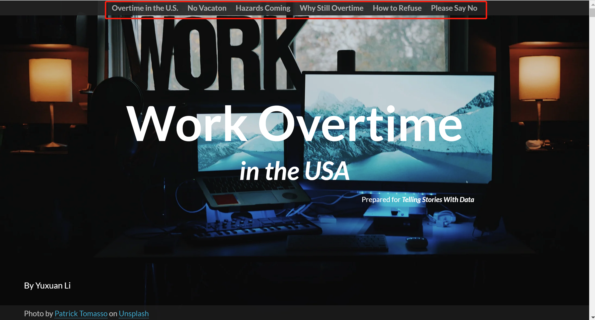
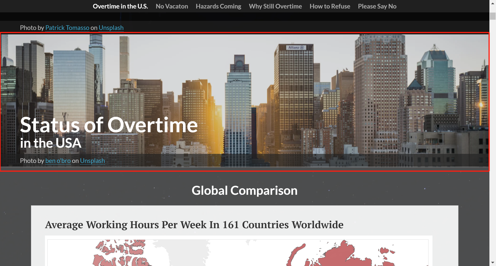
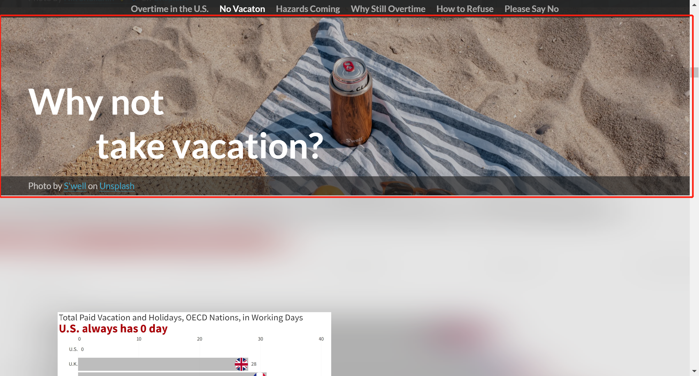
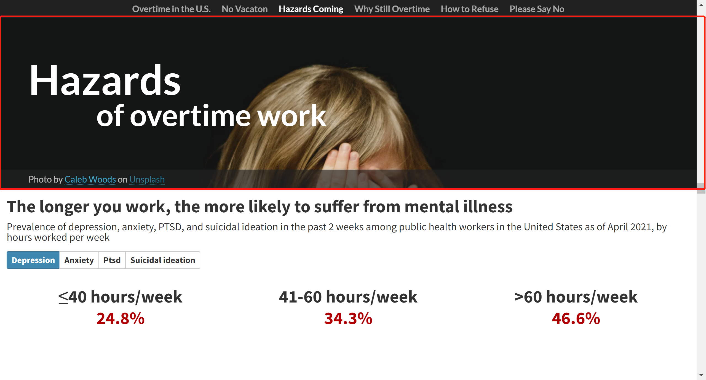
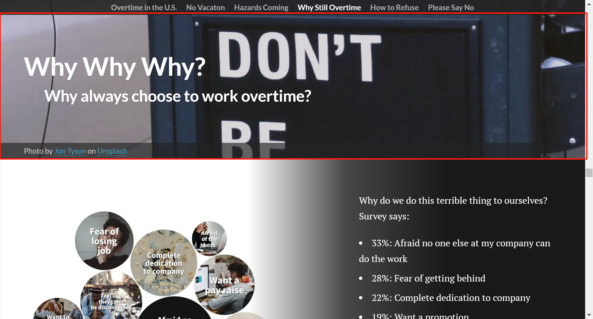
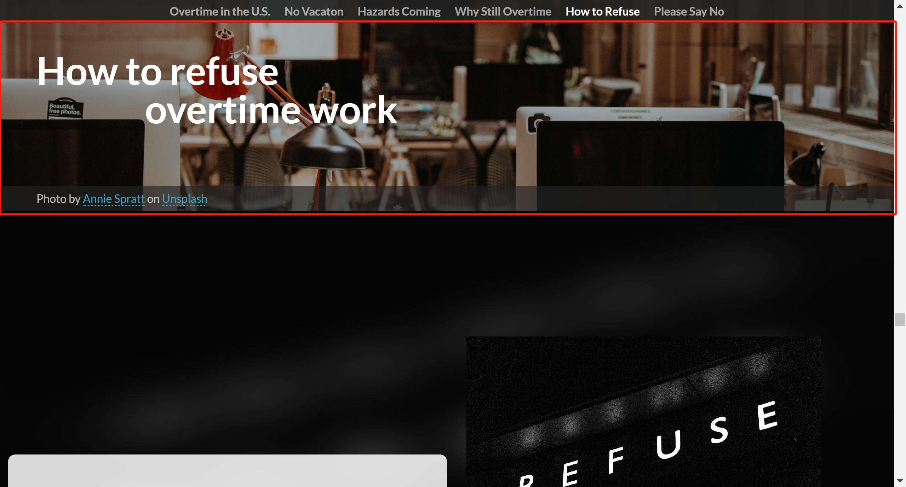
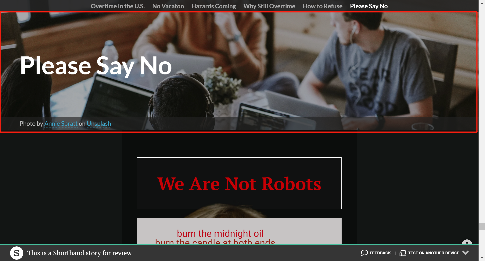
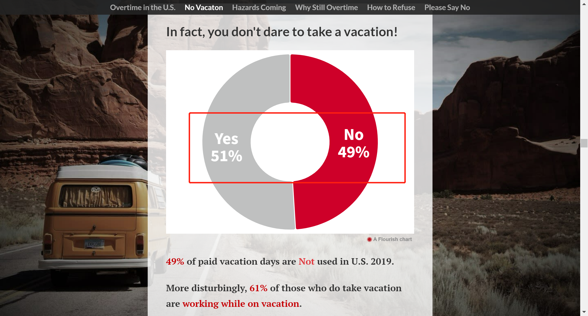
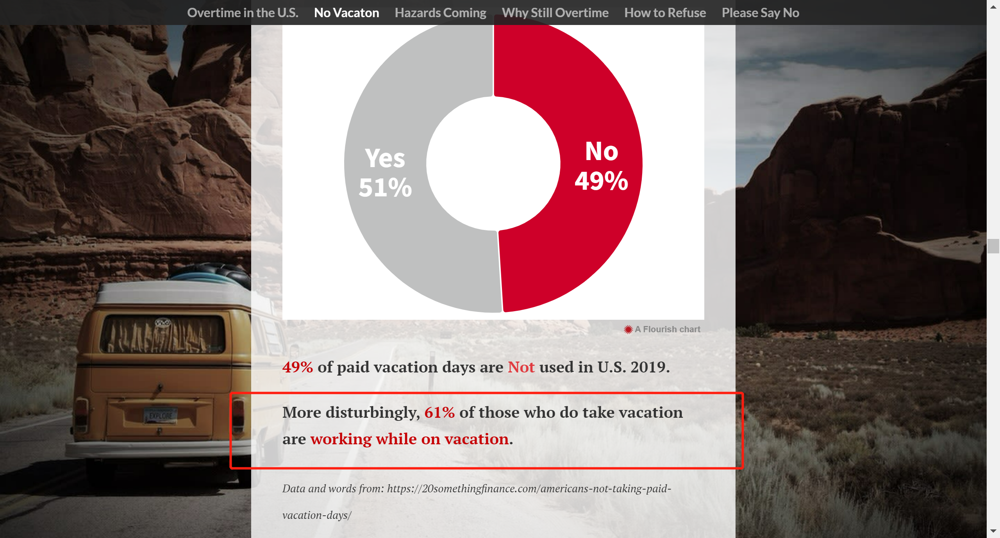

# Catalog of Final Project
**Part I:** [Brief Intro & Overview: Working Overtime in the U.S.](Final Project Part I.md)  
**Part II:** [storyboards and user research](Final Project Part II.md) 
**Part III:** [Final project and presentation](Final Project Part III.md) 
**Shorthand Website Link:** [Shorthand for final presentation]() 
  

# Brief Summary So Far 💕💪😘
## Summary for Part I ✍️
In Part I, because I hope to look at the working overtime situation in the U.S. through this project, I pick the topic about **how to solve the dilemma of working overtime in the U.S.**.   
   
After determing the topic, I planned the  whole story is divided into **7 big scenarios** of smaller story points:   
**Scenario 1:** Introduce the working hours in the countries of the world and compare with each other.   
**Scenario 2:** Focus on the average working hours in the United States.   
**Scenario 3:** Pay attention to the US paid time off situation and holiday usage data.   
**Scenario 4:** Concern about the hazards of overtime work.   
**Scenario 5:** Explore why employees work overtime even though there are so many hazards.   
**Scenario 6:** Study what kind of people are more courageous to refuse to work overtime.   
**Scenario 7:** Call to reject meaningless working overtime.   
   
And then I developed a pitch for my  presentation that included **Project Summary**, **Project Topic**, **Reader Perspective**, **Call To Action**, **The Story Arc**, and also **Data Source**. Plus, I also completed **the draft of charts** using in presentation. The chart of final project was designed and created with Tebleau, Inforgram, Flourish and Canva.  
      
Additionally, I also identified how I will tell this story. The final deliverables will be an interactive stand-alone project created with **Shorthand**. Each of the scenarios depicted above will have one or two pages on the final Shorthand website. Interaction and movement between pages will be used to promote interactivity and engagement with potential audiences. Moreover, key information will be highlighted through the use of color.  
  

## Summary for Part II 📊
In Part II, after the discussion with my classmates, I redivided the whole story into **5 big scenarios** with some small stories:   
**Scenario 1:** Setup - Look into the status of overtime in the United States   
&emsp; **Story 1.1:** Introduce the working hours in the countries of the world and compare with each other.   
&emsp; **Story 1.2:** (small conflict) Focus on the average working hours in the United States.   
**Scenario 2:** Pay attention to the US paid time off situation and holiday usage data.   
**Scenario 3:** Conflict- Concern about the hazards of overtime work.   
**Scenario 4:** In-depth exploration - Explore why employees work overtime even though there are so many hazards.   
**Scenario 5:** Resolution - How to refuse to work overtime   
&emsp; **Story 5.1:** Study what kind of people are more courageous to refuse to work overtime.  
&emsp; **Story 5.2:** How to become a person who can refuse to work overtime   
**Scenario 6:** Call on - Call to reject meaningless working overtime.   
  

Besides, I started to construct the actual narrative that will take the reader on the journey through my story. After the suggestions from classmates of my draft charts in the part I, I **redesigned the Wireframes and storyboards using Shorthand**, and also completed the **moodboard**. After that, I also identified the **Target Audience**, found representative individuals to **interview**, and collected the **feedback** from them to improve your story.  
  

## Summary for Part III 🎯
In Part III, I'm moving on to **final deliverable** which will be completed and giving the published story on Shorthand. I'm **redesigning the shorthand websites and charts** based on all previous feedbacks. I'm also providing a **writeup on Github** that summarizes my work done for the final presentation. Finally, I will implement everything into the shorthand website, and will give a **presentation** during the last class of Telling Stories With Data course in CMU. 
 

# Change in the Final Data Story 🎬
Changes made since completion of part II:
## Add menu bar
On the top of the website, I add a menu bar with the titles of each major section. This bar gives the audience a clearer idea of the structure and allows readers to effortlessly go back and forth between sections.  

  
## Add the section covers
I add the section cover before each scenarios to give the audience a clearer idea of the topic of each scenarios.  

  

  

  

  

  

  
## Change the formate of data in chart
Based on the suggestions from classmates, I change the data formate from 0.49 to 49% and from 0.21 to 21% in the chart, because it will be consistent with the description below the chart.  

  

  

## Add informatiion about working while on vacation
Based on the suggestion from classmates, they hope me to put more information about that people are still working while on vacation. They think this information made them more disappointed. Therefore, I add informatiion about working while on vacation.

  
 
## Redesign the exploration of why employees work overtime even though there are so many hazards.
  

## Redesign the content of how to refuse to work overtime
              
  
 
## Redesign the content of how to become a person who can refuse to work overtime

   
  
 
## Redesign the content of call to reject meaningless working overtime.

   
 
 

# Target audience 👨‍👩‍👧‍👦
The main target audience are employees or prospective employees who are suffering or at risk of suffering from overtime.  
Because the call to action of this whole project is to ask for workers to stand up to refuse and defend their right when overtime is so serious that it has infringed on their right, employees or prospective employees who are suffering or at risk of suffering from overtime will be more likely to relate to the content.  

  
  
 
# Suggestions from classmates 👩‍🎓👨‍🎓
1️⃣ Call to use more paid time off in the call to the last Call on part.  
2️⃣ Edit the chart about total paid vacation and paid holidays of each OECD nations, letting it give more focus on 0 by larger size. And only pick top 5 coutries to compare with the U.S.
 
# Main Findings & Possible changes
## For Logic and content
1️⃣ Add more information on how to solve or avoid the overtime problem, as this is the part that the audience cares most about.  
## For design 
1️⃣ Add a tab directory or other cue to give the audience a clearer idea of the structure.  
2️⃣ Give a well design of the cover.  
3️⃣ Redesign the last call on part. Maybe I can use some dynamic charts etc. to increase the visual experience of the audience.  
## For charts
1️⃣ Redesign the chart which presents that manufacturing, finance and information industries are more likely to have paid leave benefits. It may be possible to place these three industries in the main view area of the audience, in the upper left corner, and give a relatively large area. And the other industries in a smaller area in the lower right corner.  
2️⃣ Redesign the chart which presents the longer service requirement brings longer vacation. It might be possible to make the chart less cluttered by adding control to allow viewers to choose between private industry or the state and local government.  

# Data Source 📊
The sources of the data have been labeled below the individual sketches. Here again, the data sources are summarized.   

| Data Resource and URL | Description and Usage |
| --------------------- | ---------------------  |
| [Statistics on working time: The ILO Department of Statistics](https://ilostat.ilo.org/topics/working-time/) | The chart is used to describe average hours and prevalence of excessive working time, especially the average hours per week per employed person of each countries |
| [Work and Workplace: Gallup Historical Trends](https://news.gallup.com/poll/1720/work-work-place.aspx) | The data from survy about the working hours in the U.S.  |
| [Average hours per day spent in selected activities on days worked by employment status and sex: U.S. Bureau of Labor Statistics](https://www.bls.gov/charts/american-time-use/activity-by-work.htm) | The data from U.S. Bureau of Labor Statistics is used to describe average hours per day spent in selected activities on days worked by employment status and sex  |
| [No-Vacation Nation, Revised: CENTER FOR ECONOMIC AND POLICY RESEARCH](https://cepr.net/images/stories/reports/no-vacation-nation-2019-05.pdf) | The data is used to describe paid vacation and paid holidays, OECD Nations, in working days  |
| [79 percent of private industry workers had access to paid vacation leave in March 2019: U.S. Bureau of Labor Statistics](https://www.bls.gov/opub/ted/2020/79-percent-of-private-industry-workers-had-access-to-paid-vacation-leave-in-march-2019.htm) | The data is to describe the percent of private industry workers with paid vacation leave  |
| [Why you Are Not Taking your Paid Vacation Days, but Should: 20 Something Finance.com](https://20somethingfinance.com/americans-not-taking-paid-vacation-days/) | The survey data shows only 51% of paid vacation days being used and provide the reasons for working overtime in the U.S.  |
| [Prevalence of depression, anxiety, PTSD, and suicidal ideation in the past 2 weeks among public health workers in the United States as of April 2021, by hours worked per week: Statistics](https://www.statista.com/statistics/1255169/mental-health-conditions-among-health-workers-by-hours-worked-per-week-us/) | The data used to describe the mental illness of working overtime  |
| [Higher paid workers more likely than lower paid workers to have paid leave benefits in 2020: The Economics Daily: U.S. Bureau of Labor Statistics](https://www.bls.gov/opub/ted/2021/higher-paid-workers-more-likely-than-lower-paid-workers-to-have-paid-leave-benefits-in-2020.htm) | The data shows the higher paid workers are more likely to have paid vacation, giving us ideas about how to gain paid vacation  |
| [Paid leave benefits: Average number of sick and vacation days by length of service requirement: U.S. Bureau of Labor Statistics](https://www.bls.gov/charts/employee-benefits/paid-leave-sick-vacation-days-by-service-requirement.htm) | The data shows the longer service requirement the more paid vacation  |
| [Who receives paid vacations? : U.s. Bureau of Labor Statistics](https://www.bls.gov/ebs/factsheets/paid-vacations.htm) | The data shows which industries have more paid vacation  |

  

  
  
  
🥰Thanks for your reading. If you are interested in other works from my course portfolio of [Telling Stories with Data](https://api.heinz.cmu.edu/courses_api/course_detail/94-870/) at CMU, please feel free to visit my [Home Page](https://ivyliyuxuan.github.io/LI-YUXUAN-TSWD-Portfolio/). 
  
  
  
 
[^1]: Statistics on working time: The ILO Department of Statistics, https://ilostat.ilo.org/topics/working-time/
[^2]: Work and Workplace: Gallup Historical Trends, https://news.gallup.com/poll/1720/work-work-place.aspx
[^3]: Average hours per day spent in selected activities on days worked by employment status and sex: U.S. Bureau of Labor Statistics, https://www.bls.gov/charts/american-time-use/activity-by-work.htm
[^4]: No-Vacation Nation, Revised: CENTER FOR ECONOMIC AND POLICY RESEARCH, https://cepr.net/images/stories/reports/no-vacation-nation-2019-05.pdf
[^5]: 79 percent of private industry workers had access to paid vacation leave in March 2019: U.S. Bureau of Labor Statistics, https://www.bls.gov/opub/ted/2020/79-percent-of-private-industry-workers-had-access-to-paid-vacation-leave-in-march-2019.htm
[^6]: Why you Are Not Taking your Paid Vacation Days, but Should: 20 Something Finance.com, https://20somethingfinance.com/americans-not-taking-paid-vacation-days/
[^7]: Prevalence of depression, anxiety, PTSD, and suicidal ideation in the past 2 weeks among public health workers in the United States as of April 2021, by hours worked per week: Statistics, https://www.statista.com/statistics/1255169/mental-health-conditions-among-health-workers-by-hours-worked-per-week-us/
[^8]: Why you Are Not Taking your Paid Vacation Days, but Should: 20 Something Finance.com, https://20somethingfinance.com/americans-not-taking-paid-vacation-days/
[^9]: Higher paid workers more likely than lower paid workers to have paid leave benefits in 2020: The Economics Daily: U.S. Bureau of Labor Statistics, https://www.bls.gov/opub/ted/2021/higher-paid-workers-more-likely-than-lower-paid-workers-to-have-paid-leave-benefits-in-2020.htm
[^10]: Paid leave benefits: Average number of sick and vacation days by length of service requirement: U.S. Bureau of Labor Statistics, https://www.bls.gov/charts/employee-benefits/paid-leave-sick-vacation-days-by-service-requirement.htm
[^11]: Who receives paid vacations? : U.s. Bureau of Labor Statistics, https://www.bls.gov/ebs/factsheets/paid-vacations.htm

